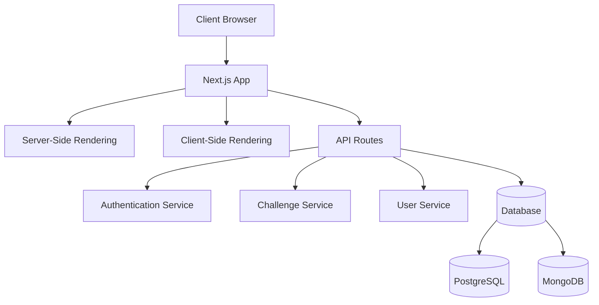

# Patterns Système

## Architecture Globale

L'application suit une architecture moderne basée sur Next.js avec une séparation claire entre les composants serveur et client. Elle utilise le App Router de Next.js 15 pour un routage optimisé et des Server Components pour améliorer les performances.



## Patterns de Conception

### Composants UI

L'architecture des composants UI suit un modèle hiérarchique avec des composants atomiques réutilisables qui sont assemblés pour créer des interfaces plus complexes.

1. **Pattern de Container/Presentation**
   - `ChallengeContainer` gère la logique et l'état
   - Les sous-composants comme `TabsNavigation` sont principalement présentationnels

2. **Pattern de Composition**
   - Les composants sont conçus pour être composables et modulaires
   - Exemple: `LeaderboardCard` peut être utilisé indépendamment

### Pattern de State Management

1. **React Hooks**
   - Utilisation intensive de `useState` et `useEffect` pour la gestion d'état locale
   - `useEffect` pour les effets secondaires comme les appels API

2. **Pattern de Chargement et d'Erreur**
   - Utilisation systématique d'états de chargement avec composants skeleton
   - Gestion des erreurs avec composants dédiés (ex: `ErrorState`)

### Pattern d'Animation

1. **Animation Conditionnelle**
   - Utilisation de `framer-motion` pour des animations fluides
   - Animations basées sur l'état (chargement, apparition, survol)

```typescript
<motion.div
  initial={{ opacity: 0, y: 20 }}
  animate={{ opacity: 1, y: 0 }}
  transition={{ duration: 0.6, delay: 0.4 }}
  className="mt-16 mb-16"
>
  {/* Contenu */}
</motion.div>
```

## Architecture des Données

### Service Layer

Les services encapsulent la logique métier et les appels API:

```typescript
// Exemple conceptuel
export class DailyChallengeService {
  static async getDailyChallenge(): Promise<DailyChallenge> {
    // Logique d'appel API
  }
}
```

### Modèles de Données

Les structures de données sont définies avec TypeScript pour un typage fort:

```typescript
type Participant = {
  id: string;
  name: string;
  avatar?: string;
  points: number;
  rank: number;
  change?: "up" | "down" | "same";
};
```

## Patterns de Performance

1. **Lazy Loading**
   - Chargement progressif des composants non critiques

2. **Optimistic UI**
   - Mise à jour de l'interface avant la confirmation du serveur pour une meilleure réactivité

3. **Skeleton Loading**
   - Composants de chargement squelette pour offrir un retour visuel immédiat
   - Ex: `MainChallengeSkeleton`, `LeaderboardSkeleton`

## Patterns d'Accessibilité

- Utilisation systématique d'attributs ARIA
- Structure sémantique avec balises appropriées
- Support du mode sombre avec classes `dark:`
- Navigation au clavier

## Patterns de Style

L'application utilise le design system shadcn/ui personnalisé avec Tailwind CSS:

```typescript
<Card className="overflow-hidden h-full border-0 bg-white/80 dark:bg-gray-950/80 shadow-sm backdrop-blur-sm">
  {/* Contenu */}
</Card>
```

## Patterns d'API

- RESTful API avec Next.js API Routes
- Gestion centralisée des erreurs
- Validation des données avec TypeScript

## Décisions Techniques Clés

1. **Next.js App Router** pour le SEO et les performances
2. **Server Components** pour réduire la taille du bundle JavaScript
3. **Framer Motion** pour des animations fluides et performantes
4. **shadcn/ui + Tailwind** pour un design système robuste et personnalisable
5. **Prisma** pour une interaction type-safe avec la base de données 